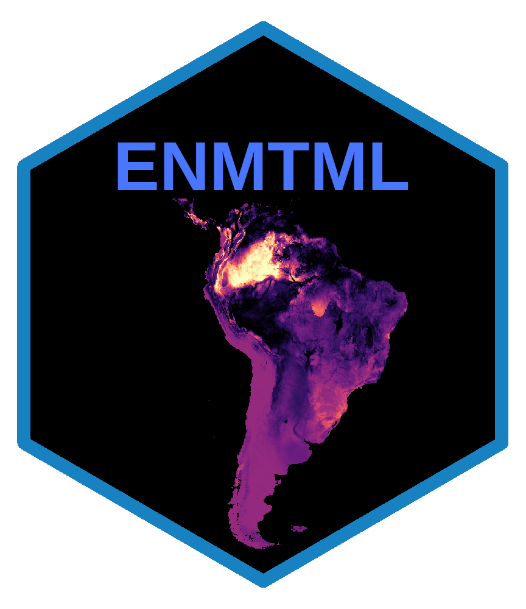

# __ENMTML__ 
[](https://doi.org/10.1016/j.envsoft.2019.104615)
[](http://www.gnu.org/licenses/gpl-3.0.html)
[](https://www.tidyverse.org/lifecycle/#manturing)

## An R package for an integrated construction of Ecological Niche Models

## <i class="fas fa-cogs"></i> Installation
```ruby
if (!"devtools"%in%installed.packages()){install.packages("devtools")}  
devtools::install_github("andrefaa/ENMTML")  
```
## <i class="far fa-question-circle"></i> Why **ENMTML**?
[ENMTML](https://andrefaa.github.io/ENMTML/) stands for **E**cological **N**iche **M**odelling at **T**he **M**eta**L**and EcologyLab.  
It is a product from the [Prof. Paulo De Marco's lab in Ubiversidade Federal de Goiás, Brasil](https://themetaland.wixsite.com/themetaland).

It puts together a lot of our work with ENM's in the past years in a single package, with the objective of making it easy to use but also covering the complex methodological development that exists in the field.

## <i class="fas fa-bullseye"></i> What is the main objective of **ENMTML**?
We believe there is a division within ENM/SDM.

Developers are constantly coming up with better methods, which causes those improvements to be scattered throughout literature and not always reach users.  
This effect is potentialized as novelties are sometimes built within different R-packages, which demand users to also have some comprehension of programming. 
 
The main objective of **ENMTML** is to minimize those issues. 
 
We gather here most of the methodological development on ENM and present them to users in a single function with arguments related to those methodological decisions. 
 
We bring together several alternatives for: 

* Variable collinearity control  
* Bias control  
* Accessible area delimitation  
* Pseudo-absence allocation  
* Data partition  
* A wide variety of algorithms   
* Thresholds  
* Evaluation metrics  
* [Deal with overprediction (MSDM)](https://github.com/sjevelazco/MSDM)  
* Ensemble models  
* Projection to a different time period/spatial extent (MOP calculation included)  

## <i class="fas fa-search"></i> What if I couldn't find what I was looking for in **ENMTML**? 

#### Please let us know!

We are regularly working on the package and are very interested in incorporating new functionalities to the package. 

## <i class="fas fa-exclamation-circle"></i></i> Last but not least  
  
**There are no defaults!** 

We believe **every ENM should be carefully planned and every decision matters!**  

We attempted to present a solid background for all methodological alternatives in our package, you can find in our article specific details on where to find a detailed description of the included methods.


### CITATION:
**Andrade, A.F.A., Velazco, S.J.E., De Marco Jr, P., 2020. ENMTML: An R package for a straightforward construction of complex ecological niche models. Environmental Modelling & Software 125, 104615. https://doi.org/10.1016/j.envsoft.2019.104615**
  
  
> Please report bugs [here](https://github.com/andrefaa/ENMTML/issues) or send an e-mail to andrefaandrade@gmail.com or sjevelazco@gmail.com! 

